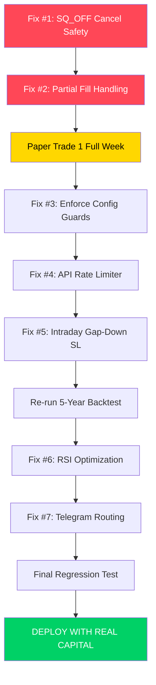

# Fix Prompt Guide — RSI-15m Expiry Breakout Bot (V16)

> **Generated from:** Deep Audit & Readiness Report  
> **Priority System:** P0 = Must-fix before real money. P1 = Fix before scaling capital. P2 = Nice-to-have hardening.

---

## Critical Bug List

| # | Priority | Issue | Location | Impact |
|---|---|---|---|---|
| 1 | **P0** | `SQ_OFF` and `DAILY_LOSS_LIMIT` use bare `except: pass` when cancelling SL/target orders. If cancel fails silently, the broker still has live SL/TP orders that will execute alongside the SQ_OFF market exit → **double execution, net short position.** | `live_trader.py:1881-1897, 1971-1976` | **Position doubling. Real money loss.** |
| 2 | **P0** | Partial fill on limit target orders creates fragmented position. If broker fills 10/30 of a TP1 sell, bot records full exit. Remaining 20 units drift untracked until next poll cycle. | `live_trader.py:1562-1601` | **Position tracking desync.** |
| 3 | **P1** | `max_position_pct` (0.8), `max_lots` (5), `risk_per_trade_pct` (0.05) exist in `config.yaml` but are never read or enforced by any code module. | `config.yaml:65-68` | **False sense of safety.** User thinks guards exist. |
| 4 | **P1** | No global API rate limiter for Groww. During high-activity periods (16+ symbols × order polling × LTP cache misses), could exceed broker rate limits and get throttled or banned. | `core/groww_client.py` | **API ban during critical moment.** |
| 5 | **P1** | Intraday candle with `open < SL` (post-halt resume) is treated as normal SL fill at SL price, not gap-down fill at open. Optimistic by ~1-3% on rare circuit breaker days. | `intraday_engine.py:668-670` | **Backtest P&L inflation ~0.1% aggregate.** |
| 6 | **P2** | `_close_trade` SQ_OFF uses `row['close']` as exit price. In live, SQ_OFF exits at market (closer to last LTP). In backtest, this is the 15:15 candle close — reasonable but inconsistent with how live SQ_OFF works. | `intraday_engine.py:816` | **Minor P&L discrepancy.** |
| 7 | **P2** | `batch_calculate_rsi` re-runs the entire smoothing loop twice per symbol (once for current, once for previous RSI) instead of extracting both from a single pass. | `expiry_rsi_breakout.py:249-261` | **2x computation cost in live mode.** |
| 8 | **P2** | `telegram._send()` is called directly in several places instead of routing through the owner/broadcast helpers. Infra alerts may leak to non-owner chat IDs. | `live_trader.py:175, 227-231, 836-841` | **Information routing.** |

---

## The Prompt Guide

### FIX #1 (P0): Harden SQ_OFF and DAILY_LOSS_LIMIT Cancel Blocks

```
You are a Senior Quant Developer. Fix the following in live/live_trader.py:

PROBLEM: The SQ_OFF block (lines ~1871-1957) and DAILY_LOSS_LIMIT block 
(lines ~1959-2037) use bare `except: pass` when cancelling SL and target 
orders before placing the exit market order.

If the cancel fails silently (e.g., network timeout, broker already processing 
the SL order), the broker still has a live SL-M SELL order AND the bot places 
a new MARKET SELL order. Both fill → net short position → catastrophic loss.

FIX REQUIREMENTS:
1. Replace all `except: pass` in the SQ_OFF and DAILY_LOSS_LIMIT blocks with
   `except Exception as e: self.logger.error(f"Cancel failed: {e}")`.
2. After EACH cancel attempt, verify the order is actually cancelled by calling
   `self.client.get_order_status(order_id)`. If status is still OPEN/PENDING,
   retry cancel up to 2 more times with 1s delay.
3. If cancel still fails after retries, log CRITICAL and send Telegram alert
   to OWNER only (use self.telegram.send_to_owner()).
4. Add a `_cancel_with_retry(self, order_id, max_retries=3)` helper method
   to avoid code duplication between SQ_OFF and DAILY_LOSS_LIMIT.
5. Ensure the total quantity of EXIT order accounts for already-cancelled
   partial exits (use remaining_qty, not original qty).

Do NOT change any other logic. Do NOT modify the backtest engine.
```

---

### FIX #2 (P0): Robust Partial Fill Handling

```
You are a Senior Quant Developer. Fix partial fill handling in live/live_trader.py.

PROBLEM: In `_handle_tp_hit` (line ~1554), `qty_filled` is read from the 
broker's order status. If the order is PARTIALLY_FILLED (e.g., 10 of 30 units 
sold at TP1), the code treats it as if nothing happened (qty_filled could be 
non-zero but not the full expected amount). The remaining unfilled units 
are not re-tracked.

FIX REQUIREMENTS:
1. In `_monitor_active_trades`, add explicit handling for PARTIALLY_FILLED status
   on target orders. When detected:
   a. Record the filled quantity and calculate partial PnL.
   b. Update `remaining_qty` by the ACTUALLY filled amount (not the expected amount).
   c. DO NOT cancel the unfilled portion — let the limit order remain live.
   d. Log the partial fill to Telegram and CSV audit log.
2. Ensure `_handle_tp_hit` uses `qty_filled` from order status (not the expected
   quantity from exit_orders config) for PnL calculation.
3. Add a guard: if `trade['remaining_qty']` would go negative, clamp to 0 and
   log CRITICAL.

Do NOT change backtest engine. Do NOT change strategy logic.
```

---

### FIX #3 (P1): Enforce Config Safety Guards

```
You are a Senior Quant Developer. Implement the following unenforced config 
guards in the RSI-15m bot:

PROBLEM: config.yaml defines `max_position_pct: 0.8`, `max_lots: 5`, and 
`risk_per_trade_pct: 0.05` — but NO code reads or enforces them.

FIX REQUIREMENTS:
1. In `live/live_trader.py → _place_pending_entry()`:
   a. Read `max_lots` from config. If `lots_per_trade > max_lots`, log WARNING
      and cap to `max_lots`.
   b. Read `max_position_pct` from config. Calculate `max_cost = balance * max_position_pct`.
      If `cost > max_cost`, log WARNING and skip trade.
   
2. In `backtest/intraday_engine.py → _enter_trade()`:
   a. Apply the same `max_position_pct` guard using `self.capital` instead of broker balance.

3. REMOVE `risk_per_trade_pct` from config.yaml and add a comment explaining 
   that risk per trade is controlled by `safe_sl_max_loss` (Rs. amount) which 
   is more precise than percentage-based sizing for options.

4. REMOVE `dynamic_sizing_enabled` placeholder from config.yaml (dead code).

Do NOT change strategy logic or reporting.
```

---

### FIX #4 (P1): Add Global API Rate Limiter

```
You are a Senior Quant Developer. Add a global API rate limiter to core/groww_client.py.

PROBLEM: No global rate limiting exists. During peak activity (16+ symbols, 
order polling, LTP checks), the bot could exceed Groww's rate limits.

FIX REQUIREMENTS:
1. Add a `RateLimiter` class (or use `time.monotonic()` tracking) in groww_client.py.
2. Enforce a maximum of 10 requests per second (configurable via config.yaml 
   under a new `api.max_requests_per_second` key, default 10).
3. Apply the rate limiter inside `_safe_call()` — before every API call, 
   check if we're within budget. If not, `time.sleep()` the minimum required.
4. Log a WARNING when rate limiting kicks in (but only once per burst, not every call).
5. The rate limiter must be thread-safe (use threading.Lock).

Do NOT change any business logic. Keep the change minimal and surgical.
```

---

### FIX #5 (P1): Intraday Gap-Down SL Handling

```
You are a Senior Quant Developer. Fix the intraday gap-down SL assumption in
backtest/intraday_engine.py.

PROBLEM: At line ~668, the code assumes all intraday (non-09:15) candles 
fill SL at the exact SL price. But if a trading halt/circuit breaker causes 
the candle to open BELOW the SL, the real fill would be at the open price (worse).

FIX:
1. Change the SL fill logic for ALL candles (not just 09:15) to:
   - If `row['open'] < trade['sl']`: fill at `row['open']` (gap below SL)
   - Else: fill at `trade['sl']` (normal SL trigger fill)
2. Log when a non-opening-candle gap-below-SL occurs (these should be very rare).

This makes the backtest more conservative and closer to live execution reality.
Do NOT change live trader logic (live uses broker SL-M which fills at market).
```

---

### FIX #6 (P2): Optimize batch_calculate_rsi

```
You are a Senior Quant Developer. Optimize `batch_calculate_rsi` in 
strategy/expiry_rsi_breakout.py.

PROBLEM: At lines 249-261, the previous RSI is calculated by re-running 
the ENTIRE smoothing loop stopping one step earlier. This doubles computation.

FIX:
1. Modify the main smoothing loop to save the second-to-last avg_g/avg_l values
   in local variables during iteration:
   ```python
   prev_avg_g, prev_avg_l = avg_g, avg_l  # Save BEFORE update
   avg_g = avg_g * alpha + gains[i] * inv_n
   avg_l = avg_l * alpha + losses[i] * inv_n
   ```
2. After the loop, compute both current_rsi (from avg_g, avg_l) and prev_rsi 
   (from prev_avg_g, prev_avg_l) in one pass.
3. Remove the second loop entirely (lines 250-261).

This cuts computation by ~50% for the live vectorized pulse.
Do NOT change `calculate_wilder_rsi` (used for backtesting).
```

---

### FIX #7 (P2): Route All Telegram Alerts Through Proper Channels

```
You are a Senior Quant Developer. Fix Telegram routing in live/live_trader.py.

PROBLEM: Several calls use `self.telegram._send()` directly instead of 
routing through `send_to_owner()` or the broadcast method. This causes 
infrastructure alerts (expiry calendar failures, cancel failures, gap fill 
aborts) to go to ALL chat IDs instead of only the owner.

FIX:
1. Audit every `self.telegram._send()` call in live_trader.py.
2. Classify each as either:
   a. INFRA alert (calendar, auth, cancel fail, halt) → route to owner only
   b. TRADE alert (entry, exit, TP hit, SL hit) → route to all chat IDs
3. Replace `self.telegram._send()` with `self.telegram.send_to_owner()` for 
   all infra alerts.
4. Ensure `TelegramNotifier` has a `send_to_owner()` method that only sends
   to `self.owner_id`.

Only modify live_trader.py and telegram_notifier.py. Do NOT touch backtest.
```

---

## Execution Order



> [!CAUTION]
> **Do NOT deploy with real capital until Fix #1 and Fix #2 are verified in paper trading for at least 5 active trading sessions.** The double-execution risk from silent cancel failures is the single highest-severity issue in the codebase.
